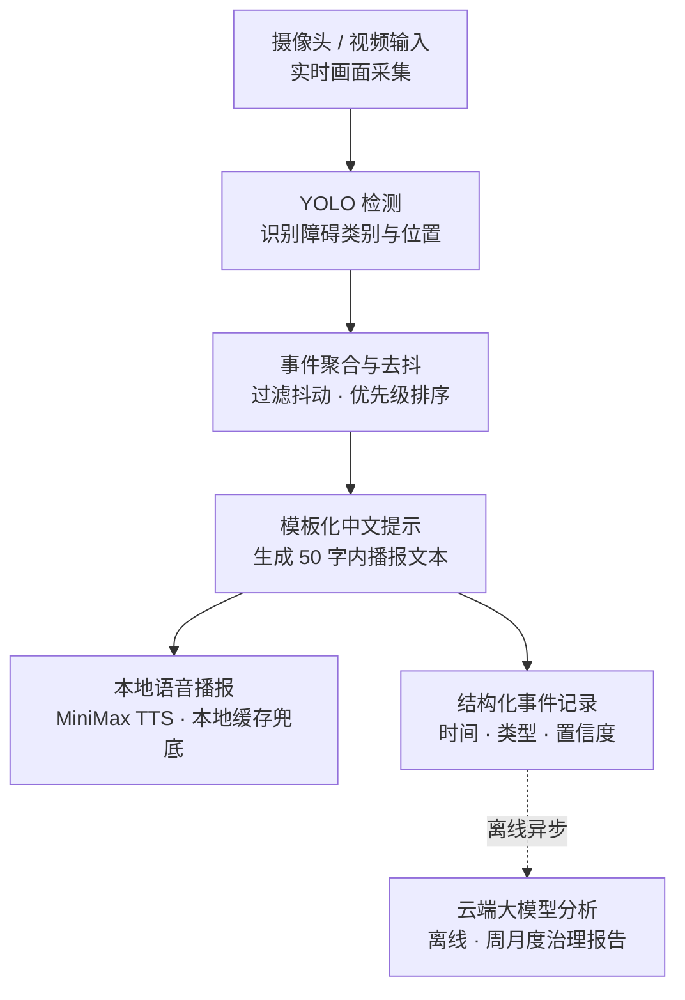
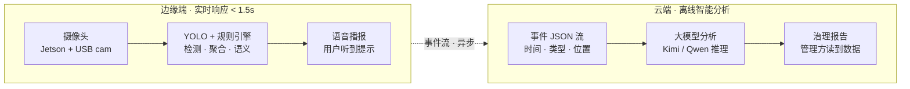

# LinkAble 研电赛 PRD V2.2 深度解读

> 配套文档：`基于边缘智能的无障碍辅助通行感知系统 - 共感 LinkAble 产品需求文档 V2.2`
> 整理时间：2026-05-12
> 用途：答辩准备、论文撰写、工程实现参考

本文是对 PRD 第 5、6、7、9、10 章关键内容的展开解读，并附三个深度议题：EventBuilder 实现、TensorRT FP16 转换、答辩 PPT 架构图设计。

---

## 目录

- [一、系统架构与技术方案（PRD 第 5 章）](#一系统架构与技术方案prd-第-5-章)
- [二、P0 功能范围与事件类别（PRD 第 6-7 章）](#二p0-功能范围与事件类别prd-第-6-7-章)
- [三、数据与性能验收指标（PRD 第 9-10 章）](#三数据与性能验收指标prd-第-9-10-章)
- [四、深度议题 A：EventBuilder 的去抖与冷却实现](#四深度议题-aeventbuilder-的去抖与冷却实现)
- [五、深度议题 B：TensorRT FP16 转换的意义](#五深度议题-btensorrt-fp16-转换的意义)
- [六、深度议题 C：答辩 PPT 用的架构图设计](#六深度议题-c答辩-ppt-用的架构图设计)
- [七、下一步行动建议](#七下一步行动建议)

---

## 一、系统架构与技术方案（PRD 第 5 章）

### 1.1 核心思想：为什么要分成两条链路

整个架构最关键的决策是把系统拆成两条独立链路。先想清楚一件事：**视障用户最怕的是延迟，不是不智能。**

- 用户走到坡道前 1 米的时候，系统晚 3 秒说话，人已经踩上去了——这是事故。
- 如果系统说"前方有坡道"而不是"前方 1.2 米处有 15° 缓坡"，用户完全够用——这只是少了一点信息。

所以这两件事被拆成独立链路：

| 链路 | 性质 | 兜底要求 |
|---|---|---|
| 边缘实时链路 | 必须极快、必须本地、必须确定 | <1.5s 响应，不依赖网络 |
| 云端离线链路 | 可以慢、可以联网、可以智能 | 用于生成统计性、解释性的治理报告 |

这种"实时归实时、智能归智能"的分层，是工程上被反复验证过的模式：自动驾驶把感知（毫秒级）和路径规划（秒级）分层；工业控制把 PLC（确定性）和 MES（分析性）分层。

PRD 5.3 节那条"规则系统兜底，LLM 不参与安全相关决策"是工程红线，不是设计偏好。**安全相关的决策永远不能交给会幻觉的东西做。**

### 1.2 完整数据流



### 1.3 主链路六个步骤详解

#### ① 摄像头 / 视频输入（硬件层）

CSI 摄像头之前出过问题，现用 USB 摄像头兜底；演示阶段还可以喂图片序列或预录视频，等价于"假装摄像头拍到的"。这是 PRD 9.3 节的阶段性止损。

#### ② YOLO 检测（感知层）

`yolo11n.pt` 的 n 是 "nano"，是 YOLOv11 系列里最小的模型，专门为边缘设备设计。输入一帧图像，输出"画面里有什么、在哪、置信度多少"，如：

```
[stairs, bbox=(312, 480, 410, 600), conf=0.87]
```

这一步只是 *看到东西*，不是 *理解东西*。

#### ③ 事件聚合与去抖（EventBuilder · 稳定层）

这一步如果没搞过会觉得多余，但它其实是整个系统能不能演示成功的关键。

YOLO 是逐帧推理的，每秒 30 帧意味着同一个台阶会被检测 30 次。如果每次都触发播报：

> "前方有台阶……前方有台阶……前方有台阶……"（一秒内说 30 遍）

这不叫辅助，这叫骚扰。EventBuilder 要做三件事：

- **去抖（debounce）**：连续 N 帧都识别到同一个 `stairs`，才算一个真事件，过滤掉单帧误检
- **冷却（cooldown）**：一个事件触发后，X 秒内同类事件不再触发，避免刷屏
- **优先级排序**：同时识别到 `stairs`（100）和 `blind_road_occupied`（70），先播台阶

具体实现见 [第四章](#四深度议题-aeventbuilder-的去抖与冷却实现)。

#### ④ 模板化中文提示（semantics.py · 表达层）

把结构化事件（"事件类型=stairs，方向=前方"）映射成一句确定的中文短句（"前方有台阶，请减速"）。**完全不用大模型**，就是查表 + 拼字符串。

为什么？因为大模型可能输出"前方似乎可能有一些类似台阶的结构"，而 PRD 第 8 节明确要求避免"可能、似乎、也许"等不确定措辞。**视障辅助黄金原则是"信息密度低、决策清晰"**——给一个明确指令，不要给概率描述。

#### ⑤ 本地语音播报（audio.py · 输出层）

MiniMax `speech-2.8-hd` + `presenter_female` 在线合成，但 *所有 P0 短句提前预生成 mp3 缓存到本地*。展会现场万一网络挂了，直接放 mp3。再不行，终端打印字幕。这是 PRD 第 8 节的降级表。

#### ⑥ 结构化事件记录（publisher.py · 沉淀层）

同一个事件，除了播给用户听，也以 JSON 格式落盘：

```json
{
  "node_id": "campus_gate_north",
  "timestamp": "2026-05-12T14:23:45+08:00",
  "type": "blind_road_occupied",
  "confidence": 0.87
}
```

这是云端大模型分析能跑起来的*前提*——没有结构化日志，就没有报告可生成。这条数据沉淀链路也是 PRD 2.1 节"治理价值是项目最有可能落地的价值"的实现路径，其他导盲产品都没有这一层。

### 1.4 增强链路：大模型到底做了什么

很多人看到"大模型"就想塞到实时推理里——这是个常见误区。LinkAble 的设计反过来：

```
publisher.py 每天导出一个 JSONL 事件流
  ↓ （离线，可能几小时跑一次）
report_gen.py 把事件流喂给 Kimi/Qwen
  ↓
大模型生成自然语言报告：
"本周 A 入口盲道被占用 23 次，82% 集中在 11:30-13:00；
建议在该时段增加巡检"
```

大模型做的是 **统计 → 自然语言** 的工作，不是 **图像 → 决策**。它跑得慢一点没关系，错一点也无所谓（人会审）。这条链路对应 PRD 6.2 节的 P1 工作，也是研电赛"AI 智能体专项赛"的切入点。

### 1.5 5.3 节四条设计原则的"为什么"

| 原则 | 一句话理解 |
|---|---|
| 端侧实时优先 | 安全相关决策必须本地完成，网络是不可信组件 |
| 本地音频缓存 | 演示现场网络是不可控因素，必须有兜底 |
| 大模型离线增强 | 大模型贵且慢且会幻觉，只在不影响实时性的场景使用 |
| 规则系统兜底 | 确定性 > 智能性，特别是安全相关场景 |

这四条本质是**工程纪律**，不是技术选择。任何"边缘 AI + 安全场景"的系统都遵守类似纪律。写在 PRD 里，答辩时评委一看就知道想清楚了。

### 1.6 模块表：架构怎么落到代码

8 个 Python 模块和 6 个步骤的对应关系：

| 模块 | 对应步骤 | 职责 |
|---|---|---|
| `detector.py` | ② YOLO 检测 | YOLOv11 推理，P0 类别过滤 |
| `event_builder.py` | ③ 聚合去抖 | 滑动窗口、冷却、优先级裁决 |
| `semantics.py` | ④ 模板提示 | 事件转模板化中文 |
| `audio.py` | ⑤ 语音播报 | MiniMax TTS + 本地缓存兜底 |
| `publisher.py` | ⑥ 事件记录 | JSON 落盘、可选 HTTP 上报 |
| `pipeline.py` | 串联 ②-⑥ | 胶水代码 |
| `usb_demo.py` | 主入口 | 摄像头初始化 + 拉起 pipeline |
| `report_gen.py` | P1 离线增强 | 事件流 → LLM → 报告 |

这种"一个模块一个职责"的拆分叫**单一职责原则**。好处是某一步出问题（比如 TTS 挂了），只需要改 `audio.py`，不需要动其他七个文件。也方便论文里画模块图。

### 1.7 部署形态的选择

V2.2 把穿戴式从主形态降为演示形态。原因 PRD 1.3 节也写清楚了：Jetson 持续供电 + 散热 + 开放道路的安全责任，三个都决定了它穿不上人。**真正的主形态是固定部署或巡检**，演示形态只是为了拍视频好看。

| 形态 | 当前定位 | 应用场景 |
|---|---|---|
| 固定点位部署 | **推荐主形态** | 盲道入口、坡道入口、楼宇门口、地铁口 |
| 手持/推车式巡检 | **推荐主形态** | 校园、社区无障碍环境周期性巡检 |
| 短距离佩戴 | **演示形态** | 仅用于拍摄演示视频片段 |

答辩标准回应（来自 PRD 15 节）：

> Q：怎么戴在盲人身上？
> A：当前版本是边缘智能原型系统，主要部署形态是固定节点和手持巡检，不是穿戴式产品。穿戴形态仅作为演示场景。穿戴化是后续轻量化硬件设计的工作方向。

---

## 二、P0 功能范围与事件类别（PRD 第 6-7 章）

### 2.1 P0 / P1 / P2 的真实含义

这是产品管理里最经典的优先级框架，但很多人没用对。它**不是**"P0 是重要的，P1 是次要的，P2 是更次要的"——这种理解会让你永远做不完。正确的理解是：

| 等级 | 真实含义 | 决策后果 |
|---|---|---|
| P0 | 没有它，项目交不了 | **必须做完才能演示** |
| P1 | 有它锦上添花，没它项目也成立 | P0 稳定后才碰 |
| P2 | **明确声明不做** | 答辩被问到就说"不在本期范围" |

**P2 那一栏是最重要的，但最容易被忽略。** PRD 6.3 写"实时大模型语义增强（与实时性矛盾）"、"用户主动语音问答（延迟链路过长）"、"志愿者互助系统"——这不是在说"我做不完所以放弃了"，而是在说**这些东西跟我的架构原则冲突，所以我主动不做**。

这种表述答辩时极其有用。如果评委问："为什么不加个语音问答功能？"标准回答是：

> 语音问答需要 ASR → LLM → TTS 链路至少 3-5 秒，跟我们 <1.5s 的实时性目标冲突。所以这不是迭代节奏问题，是架构边界问题。

这一句话就把"做不完"框成了"想清楚了"。

### 2.2 4 个 P0 类别的选择逻辑

类别选择的逻辑是**伤害可逆性 + 演示可控性**的交集：

| 类别 | 优先级 | 伤害性质 | 可逆性 |
|---|---|---|---|
| `stairs` | 100 | 踩空 = 摔倒 | 不可逆伤害 |
| `road_obstacle` | 80 | 撞上 = 可能受伤 | 部分可逆 |
| `blind_road_occupied` | 70 | 需绕行 = 不便 | 完全可逆 |
| `ramp` | 60 | 通常是辅助信息 | 不阻挡通行 |

### 2.3 优先级数字怎么起作用

**这些数字不只是排名，是 EventBuilder 里的实际权重。** 当同一时刻同时识别到台阶和盲道占用时，系统不能两句一起播，必须选一句。规则是：取优先级最高的事件，其余丢弃或延后。100 vs 70 这个差值是真的会被代码读取的。

所以这张表本质上是**安全策略的硬编码**。答辩时如果评委问"会不会同时检测到多个障碍导致播报混乱"，回答是："我们用优先级数字做硬性裁决，最高优先级胜出。"

### 2.4 P1 预留类别的考虑

红绿灯（`traffic_red`/`traffic_green`）、人行横道（`crosswalk`）放 P1 不是技术做不到，是**它们属于不同语义层**：

- 路口场景和单纯通行场景的判断逻辑差异大
- 跨场景模型容易劣化
- 需要不同的数据集分布

先把"通行风险检测"做扎实，再扩"路口决策"。这种分层思路对答辩也是加分项。

---

## 三、数据与性能验收指标（PRD 第 9-10 章）

### 3.1 600 张数据够用的前提

600 张够，前提是用对方法。**不是从零训一个模型，是在 COCO 预训练的 yolo11n 上做迁移学习。**

CV 领域的经验：

| 数据规模 | 训练范式 | 可信度 |
|---|---|---|
| 0-100 张 | 纯靠预训练 + 强增广 | 可演示但不可信赖 |
| 100-1000 张 | **迁移学习的甜区** | LinkAble 的目标范围 |
| 1000+ 张 | 开始接近从头训的下界 | 工程级可用 |

600 张配合数据增广（翻转、亮度、模糊、Mosaic），等效样本可以拉到 3000-5000 张水平。论文里可以写："本研究采用小样本迁移学习范式……"

### 3.2 数据分布的设计逻辑

PRD 9.1 节的推荐分布不是随手定的：

| 场景 | 占比 | 设计依据 |
|---|---:|---|
| 盲道占用 | 35% | 演示主场景（路线 A 点）+ 治理价值锚点 |
| 台阶 | 20% | Zenodo 公开数据集可补齐，cold-start 不全自采 |
| 坡道 | 20% | 同上，公开数据可借 |
| 路面障碍 | 25% | 兜底类，需自采但相对容易拍到 |

35% 给盲道占用，是因为它同时是 PRD 4 节演示主场景的核心和 2.1 节治理价值论点的锚点。

### 3.3 模型转换链路：PyTorch → ONNX → TensorRT

三步链路每一步在做不同的事：

| 阶段 | 文件 | 在做什么 | 不可省的原因 |
|---|---|---|---|
| 训练态 | `best.pt` | PyTorch 原生权重 | 训练过程中的输出 |
| 中间态 | `model.onnx` | 跨框架交换格式 | TensorRT 不直接读 PyTorch |
| 部署态 | `model.engine` | NVIDIA 优化引擎 | 真正在 Jetson 上跑的东西 |

TensorRT 拿到 ONNX 后会做三件 PyTorch 做不到的事：

1. **层融合（layer fusion）**：把 `Conv → BatchNorm → ReLU` 三个独立算子合并成一个 CUDA kernel，省掉中间内存读写。YOLO 里这种序列特别多，融合后吞吐能涨 30-50%。
2. **kernel 自动选择**：TensorRT 内置上百个针对不同输入尺寸的卷积实现，会在转换时实测选最快的。PyTorch 跑不了的优化。
3. **精度降级（FP16）**：把权重从 32 位浮点压成 16 位。

详见 [第五章](#五深度议题-btensorrt-fp16-转换的意义)。

### 3.4 阶段性止损：工程纪律

PRD 9.3 节是这份 PRD 写得最好的部分之一。它在说：每一个技术依赖都有 Plan B。

| 风险点 | Plan B |
|---|---|
| 自定义模型未完成 | 用 COCO 代理类（chair/person）演示完整链路 |
| TensorRT 未完成 | PyTorch/Ultralytics 原生先跑通 |
| 摄像头未恢复 | 图片序列或视频文件模拟移动场景 |

**演示成败永远不要押在单点上**，这是工程纪律。

### 3.5 时延预算：1500ms 如何分配

PRD 10 节那个 `<1.5s` 不是拍脑袋写的，是**从用户行走速度反推**：

> 普通步速 1.2 m/s，1.5 秒 = 1.8 米。
> 也就是说：当系统识别到障碍时，用户离它至少还有 1.8 米可反应距离。再慢，就来不及了。

整个 1500ms 的分配（估算，需替换为实测数据）：

| 链路 | 端侧处理 | 音频生成 | 音频播放启动 | 总耗时 | 预算余量 |
|---|---:|---:|---:|---:|---:|
| 云端 TTS 路径 | 220ms | 700ms | 100ms | **1020ms** | 480ms |
| 本地缓存路径 | 220ms | 5ms | 100ms | **325ms** | 1175ms |

端侧处理 = 帧捕获 + YOLO + EventBuilder 聚合 + 语义模板。

**这张表的关键洞察**：云端 TTS 网络合成几乎占了一半预算。这就是为什么 PRD 5.3 节"本地音频缓存"被列为四大设计原则之一——它不是优化项，是兜底项。展会现场万一网络抖动，云端路径直接逼近 1500ms 红线甚至超出；缓存路径稳稳在 350ms 内。

### 3.6 其他指标的内在约束

| 指标 | 它在保证什么 |
|---|---|
| ≥30 FPS | 摄像头帧率匹配，不丢帧 |
| <100ms 单帧推理 | 留出 200-300ms 给后续环节 |
| <1.5s 端到端 | 用户有 1.8m 反应距离 |
| ≥80% 准确率 | 演示场景可信，论文数据可读 |
| 冷却时间不重复 | 用户体验不被骚扰 |
| 离线演示能力 | 评委断网也能看 |

这些不是孤立指标，是**一条相互约束的链**：30 FPS 决定单帧预算 33ms，留给 YOLO 推理的窗口是 100ms（允许多帧并行），剩下的全靠端到端 <1.5s 兜住。任何一环超标，整条链就断。

### 3.7 答辩必须量化的清单

答辩之前必须刷一遍，每一项都准备一个具体数字：

- [ ] **FPS / 单帧延迟 / 端到端延迟**：评委必问"实时性怎么保证"
- [ ] **TTS 冷启动 vs 缓存命中延迟**：解释 cache 的工程价值
- [ ] **典型场景识别成功率**：每个 P0 类别一个数字（如 stairs 87%、blind_road 82%）
- [ ] **数据集规模与类别分布**：600 张 + 35/20/20/25 分布
- [ ] **演示场景实测记录**：A/B/C/D 四个点位各跑 10 次，写命中率
- [ ] **国内外同类技术对比**（展架硬性要求）

最后一项最容易被忽略。研电赛展架是 80×180cm 的物理展板，评委 30 秒扫一眼就走——这张对比表要让人一眼看出"LinkAble 在哪个象限"。PRD 11 节那张表已经写好，记得在展架设计阶段把它放在视觉中心位置。

---

## 四、深度议题 A：EventBuilder 的去抖与冷却实现

核心问题：YOLO 30 FPS 逐帧检测，同一个台阶会被识别 30 次。EventBuilder 要把这 30 次"原始检测"塌缩成 1 次"用户感知到的事件"。

它实际上是一个**按类别管理的小型状态机**。每个类别独立维护两件事：一个滑动窗口、一个冷却时间戳。

### 4.1 完整 pseudocode

```python
from collections import deque, defaultdict
from dataclasses import dataclass
import time

@dataclass
class Event:
    cls: str
    timestamp: float
    confidence: float

class EventBuilder:
    def __init__(self):
        # 每类一个最近 N 帧的滑动窗口
        self.windows = defaultdict(lambda: deque(maxlen=5))
        # 每类的冷却到期时间
        self.cooldown_until = {}
        # 配置常量
        self.CONFIRM_FRAMES = 3      # 连续 N 帧确认才算事件
        self.COOLDOWN_SEC = 5.0      # 同类事件冷却秒数
        self.PRIORITY = {
            'stairs': 100,
            'road_obstacle': 80,
            'blind_road_occupied': 70,
            'ramp': 60,
        }

    def update(self, detections, now):
        # 1. 把本帧检测结果按类别塞进各自的窗口；
        #    没出现的类别也要 append None,保持窗口时序对齐
        seen = {d.cls for d in detections}
        for det in detections:
            self.windows[det.cls].append(det)
        for cls in list(self.windows.keys()):
            if cls not in seen:
                self.windows[cls].append(None)

        # 2. 找出"已确认"且不在冷却期的候选事件
        candidates = []
        for cls, window in self.windows.items():
            valid = [x for x in window if x is not None]
            if len(valid) >= self.CONFIRM_FRAMES:
                if now >= self.cooldown_until.get(cls, 0):
                    avg_conf = sum(x.confidence for x in valid) / len(valid)
                    candidates.append((cls, avg_conf))

        # 3. 优先级裁决:同时多个候选时,取最高优先级
        if not candidates:
            return None
        winner_cls, winner_conf = max(
            candidates,
            key=lambda x: self.PRIORITY[x[0]]
        )

        # 4. 触发并设置冷却
        self.cooldown_until[winner_cls] = now + self.COOLDOWN_SEC
        return Event(cls=winner_cls, timestamp=now, confidence=winner_conf)
```

### 4.2 四个设计取舍

#### `CONFIRM_FRAMES = 3` 不是拍脑袋

在 *响应速度* 和 *误检鲁棒性* 之间做平衡：

| 取值 | 响应延迟（30 FPS） | 误检鲁棒性 |
|---|---|---|
| 1 帧 | 33ms | 跟 YOLO 一样会闪烁误触发 |
| 3 帧 | 100ms | 能过滤大部分单帧抖动（甜区） |
| 5 帧 | 167ms | 吃掉过多时延预算 |

**论文 Tip**：你可以做一个消融实验（`CONFIRM_FRAMES = 1/2/3/4/5` 对应的误检率 vs 响应延迟），这是个廉价又出彩的 ablation。

#### 为什么窗口里保留 `None`

因为"障碍消失"本身就是状态——用户走过台阶之后，stairs 类别应该从窗口中"自然淡出"。如果只 append 有检测的帧，会导致一个早就走远的障碍被"幽灵保留"，下次又被误触发。

#### 冷却是按类的，不是全局的

如果用户先听到"前方有坡道"（ramp 进入 5s 冷却），紧接着 1 秒后又遇到台阶，系统会立刻播"前方有台阶"——因为 stairs 不在 ramp 的冷却里。

**这正是想要的：安全相关事件不能被次要事件的冷却给压住。**

#### 优先级裁决每帧都跑

如果 stairs 和 blind_road 同帧都确认了，永远 stairs 胜出。

潜在问题：如果 stairs 进入冷却后，blind_road 立即播——可能让用户觉得"刚说完台阶又说盲道，太啰嗦"。

**实战中可以加一个全局最小间隔**，比如任意事件之间至少 1.5 秒：

```python
self.last_any_event_at = 0
self.MIN_GAP_SEC = 1.5

# 在第 3 步加一道全局闸门:
if now - self.last_any_event_at < self.MIN_GAP_SEC:
    return None
```

这种细节答辩时不一定会被问到，但论文里写了，评委会觉得"这个学生想得很细"。

---

## 五、深度议题 B：TensorRT FP16 转换的意义

### 5.1 三阶段链路再回顾

每一步在做不同的事：

| 阶段 | 文件 | 在做什么 |
|---|---|---|
| 训练态 | `best.pt` | PyTorch 原生权重，能跑但慢 |
| 中间态 | `model.onnx` | 跨框架交换格式，类似"模型的 PDF" |
| 部署态 | `model.engine` | NVIDIA 专为 Jetson 优化的推理引擎 |

### 5.2 FP16 的取舍

精度对比：

| 精度 | 单参数大小 | Jetson Orin Nano 推理速度 | mAP 损失 | 适用场景 |
|---|---|---|---|---|
| FP32 | 4 字节 | 基线 | 0% | 训练、fallback |
| FP16 | 2 字节 | 1.5-2× | <1% | **标准 Jetson 部署** |
| INT8 | 1 字节 | 2-4× | 1-3%（需校准） | 极致性能场景 |

为什么 FP16 是 Jetson 的甜区？因为 Orin 的 Tensor Core 对 FP16 是原生硬件加速的，FP32 实际上是在"用半个硬件能力"——花同样的电跑慢一半。INT8 更快但要准备校准数据集，且某些算子不支持，对小规模项目性价比不高。

### 5.3 实际操作命令

Ultralytics 一行命令搞定：

```bash
yolo export model=runs/train/exp/weights/best.pt format=engine \
    half=True device=0 imgsz=640
```

`half=True` 就是 FP16。会先转 ONNX 再转 engine，输出 `best.engine` 文件。之后 `YOLO("best.engine")` 就直接用 TensorRT 推理。

性能 benchmark 也是一行命令：

```bash
yolo benchmark model=best.pt imgsz=640 device=0
```

会自动给你 pt/onnx/engine 三个格式的 FPS 对比表，论文 4.2 节直接可以贴。

### 5.4 两个常见坑

#### 坑 1：`.engine` 文件绑定具体 GPU 架构

你在 Orin Nano 上转出来的 engine 不能拿到别的卡上跑，包括别人的 Orin（CUDA driver 版本不同也会失败）。所以代码里要保留"找不到 engine 就 fallback 到 onnx 或 pt"的逻辑：

```python
from pathlib import Path
from ultralytics import YOLO

def load_best_model(base="weights/best"):
    for ext in ["engine", "onnx", "pt"]:
        p = Path(f"{base}.{ext}")
        if p.exists():
            return YOLO(str(p))
    raise FileNotFoundError("找不到任何可用的模型文件")
```

#### 坑 2：第一次推理有 warm-up 延迟

TensorRT 在加载时做 lazy 初始化，第一次推理会有几百毫秒到几秒的延迟。

**演示前务必跑一次 dummy 推理"暖机"**：

```python
import numpy as np
dummy = np.zeros((640, 640, 3), dtype=np.uint8)
_ = model(dummy)  # warm-up
# 之后再开摄像头循环
```

### 5.5 论文里要写的对比

至少给出 FP32 vs FP16 在 Jetson 上的实测对比：

| 格式 | FPS | 单帧推理时延 | mAP@0.5 | 显存占用 |
|---|---:|---:|---:|---:|
| PyTorch FP32 | ? | ? | ? | ? |
| ONNX FP32 | ? | ? | ? | ? |
| TensorRT FP16 | ? | ? | ? | ? |

这是审稿人最容易关注的工程细节。

---

## 六、深度议题 C：答辩 PPT 用的架构图设计

### 6.1 PRD 架构图 vs PPT 架构图

PRD 里那张图是**实现导向**的——给开发者看，每个模块一个 box。答辩 PPT 的架构图目标完全不同：

| 维度 | PRD 架构图 | PPT 架构图 |
|---|---|---|
| 目标读者 | 实现你的人 | 评判你的人 |
| 阅读时长 | 几分钟细读 | 30 秒扫一眼 |
| 想传达 | "怎么做的" | "为什么这么做" |
| 元素数量 | 7-8 个 box | ≤5 个 box |
| 关键信息 | 模块名、数据流 | 双链路 + 双价值 |

PPT 架构图的核心是**让评委一眼看到双链路双价值**——边缘端服务用户，云端服务管理方。这是 PRD 2.1 节论点的视觉化。

### 6.2 双链路价值架构图

布局上用横向 swim lane（泳道）而不是纵向流程：



### 6.3 几个关键设计点

**横向泳道代替纵向流程。** 纵向流程图适合"看一遍记住步骤"；横向泳道适合"扫一眼记住对比"。答辩评委需要的是后者。两条泳道一上一下，**位置本身就在说"这是两个并行的世界"**。

**子节点合并，颗粒度上提。** 把"事件聚合""去抖""语义生成"三个步骤合成一个 `YOLO + 规则引擎` 框。评委不需要知道你内部的模块切分。要展示细节，单独开一张 PPT slide 讲 EventBuilder。

**颜色编码价值方：**

| 颜色 | 含义 |
|---|---|
| 紫色 | 端侧实时（用户侧） |
| 黄色 | 云端离线（管理侧） |
| 灰色 | 数据流转中间态 |
| 青色 | 用户最终拿到的东西 |

这是对 PRD 2.1 节论点的视觉化。

**末端 box 用"价值语言"而不是"技术语言"。** 不是写 "TTS 合成"，是写"用户听到提示"。不是写"LLM API 调用"，是写"管理方读到数据"。**评委关心结果不关心实现**，特别是在 30 秒扫一眼的展架场景里。

**虚线箭头跨越泳道。** 那条虚线携带两层信息：①数据真的在流动；②是异步的（虚线 ≠ 实时同步）。这一根线就把"为什么大模型放云端不影响实时性"的疑虑回答掉了。

**两条泳道用 dashed 容器框起来。** 让"双链路"这件事变得明示而非暗示。没框起来的话，6 个 box 评委会以为是一个流程的 6 步。

### 6.4 PPT/展架版的额外加工

实际放到 PPT 里时，再加两个细节：

- **左上角加一个一句话标题**："双链路架构：端侧服务用户，云端服务治理"——把图想表达的中心论点直接写出来。
- **每个泳道右边加一个用户/管理方的人像剪影或图标**，进一步强化"价值给谁"。

如果做展架（80×180cm 大尺寸）版本，把这张图的字号放大、增加留白、把 dashed border 换成更深的实线就行。**结构不变。**

---

## 七、下一步行动建议

按优先级排序的具体动作：

1. **跑 EventBuilder 的 CONFIRM_FRAMES 消融实验**
   - 取值 1/2/3/4/5，记录每档下的误检率和响应延迟
   - 论文实验章节里廉价又出彩的数据点

2. **跑 Ultralytics benchmark 拿到 pt/onnx/engine 对比**
   ```bash
   yolo benchmark model=best.pt imgsz=640 device=0
   ```
   - 论文 4.2 节直接可贴
   - 答辩"实时性怎么保证"标准答案

3. **预生成 P0 短句 mp3 缓存**
   - 推荐文案（PRD 8 节）那 4 句话提前用 MiniMax 合成
   - 文件放进 `assets/audio/`，audio.py 实现"先查缓存，miss 才调云端"

4. **A/B/C/D 四个点位各跑 10 次实测**
   - 记录每个点位的命中率、误触发率、平均响应延迟
   - 作为 PRD 10 节"演示场景实测记录"的硬数据

5. **PPT 架构图先画出来，作为答辩 PPT 第 2 页**
   - 第 1 页：标题 + 30 秒介绍
   - 第 2 页：双链路价值架构图（本文档 6.2）
   - 第 3 页起：技术细节、数据、对比表

---

## 附录：关键参数速查

### 模型与推理

| 参数 | 值 |
|---|---|
| 模型 | yolo11n |
| 输入尺寸 | 640×640 |
| 部署格式 | TensorRT FP16 (`.engine`) |
| 目标 FPS | ≥30 |
| 单帧延迟 | <100ms |

### EventBuilder

| 参数 | 值 |
|---|---|
| 滑动窗口长度 | 5 帧 |
| 确认所需帧数 | 3 帧 |
| 同类冷却时间 | 5.0s |
| 推荐全局最小间隔 | 1.5s |

### 类别优先级

| 类别 | 优先级 |
|---|---:|
| `stairs` | 100 |
| `road_obstacle` | 80 |
| `blind_road_occupied` | 70 |
| `ramp` | 60 |

### TTS 配置

| 参数 | 值 |
|---|---|
| Model | `speech-2.8-hd` |
| Voice | `presenter_female` |
| 推荐文案长度 | <50 字 |
| 本地缓存格式 | mp3 |

### 性能验收

| 指标 | 目标 |
|---|---|
| 端到端响应 | <1.5s |
| 主要场景准确率 | ≥80% |
| 同类事件去重 | 冷却时间内不重复 |
| 离线演示能力 | 云端不可用时仍可播报 |
